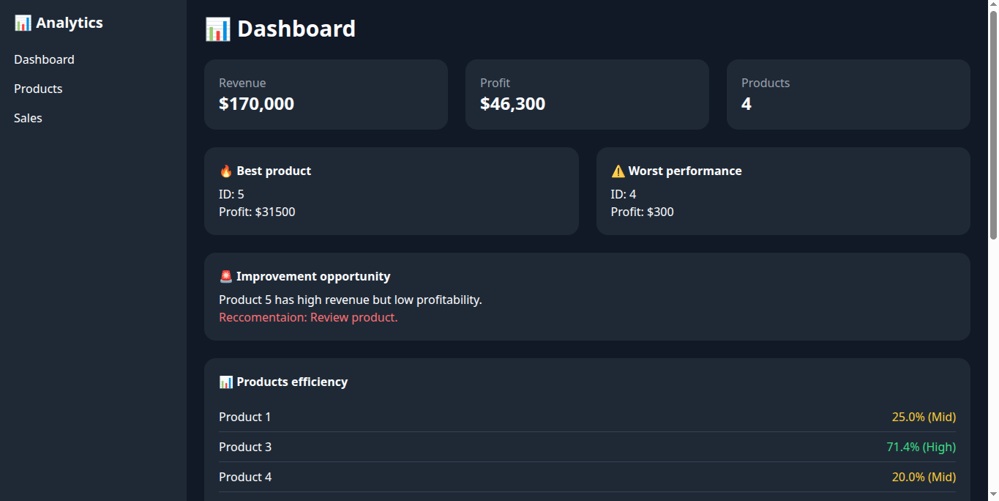
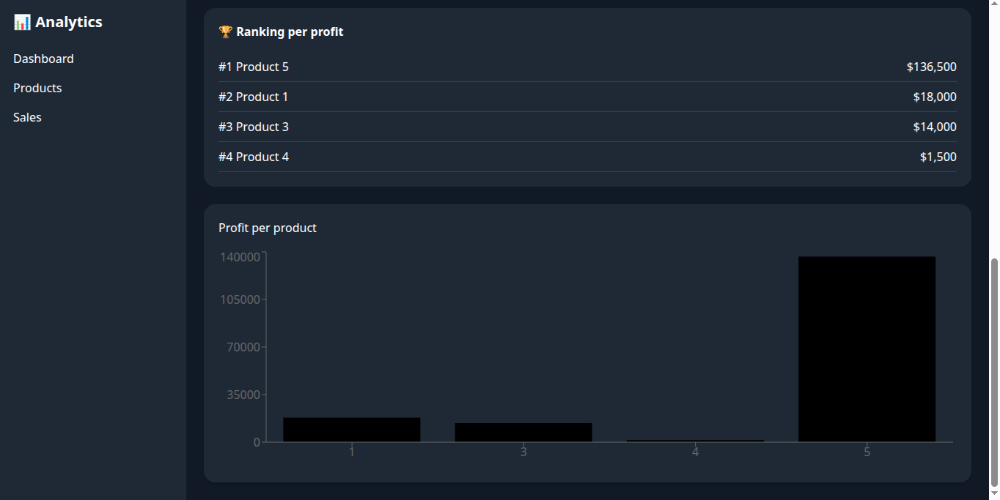
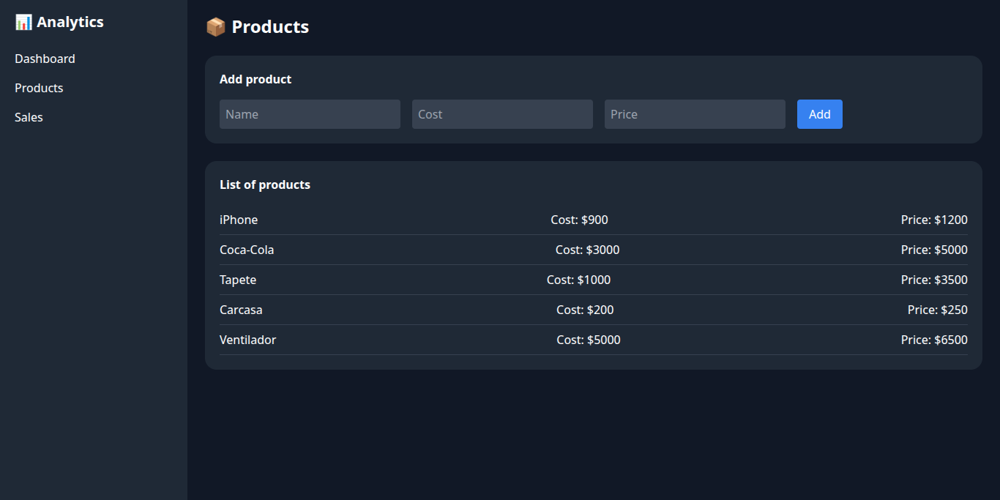
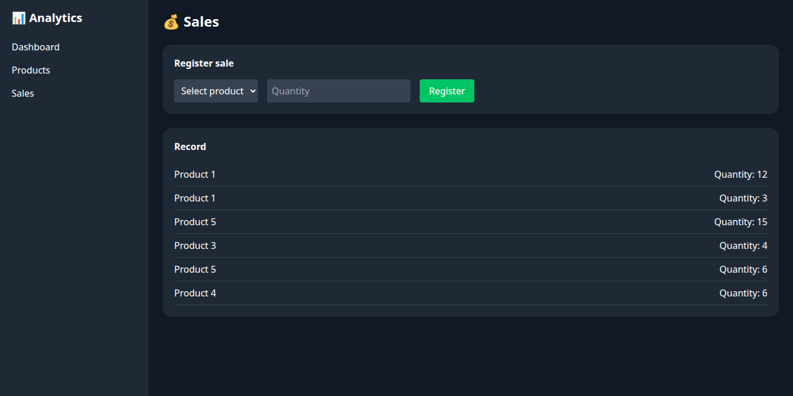

# E-commerce Analytics Dashboard

A full-stack analytics dashboard for visualizing product sales, revenue, profit, and performance metrics. This project was built to demonstrate full-stack development skills using React, FastAPI, SQLite, and data visualization techniques for business decision support.

---

## 🚀 Live Demo

> Soon.

- Frontend: 
- Backend API: 

---

## 📸 Screenshots






---

## ✨ Features

### 📊 Analytics Dashboard
- Revenue, profit, and product count KPIs
- Product efficiency analysis based on profit margin
- Best-performing and worst-performing products
- Revenue ranking
- Business insight cards
- Interactive sales charts

### 📦 Product Management
- Create and delete products
- Store product cost and selling price
- Persist data in SQLite

### 💰 Sales Management
- Register sales by product and quantity
- Automatic revenue and profit calculations
- Sales history view

### 🧠 Business Intelligence
- Aggregated insights by product
- Profit margin classification (High, Medium, Low)
- Opportunity detection for low-margin products with high revenue

### 🎨 User Experience
- Responsive dashboard layout
- Sidebar navigation
- Loading, empty, and error states
- Dark theme interface

---

## 🛠️ Tech Stack

### Frontend
- React
- Tailwind CSS
- Axios
- Recharts

### Backend
- FastAPI
- Python
- SQLite
- Pandas

### Development Tools
- Git
- GitHub
- npm
- pip
- Uvicorn

---

## 📁 Project Structure

```text
ecommerce-analytics-dashboard/
├── backend/
│   ├── main.py
│   ├── database.py
│   ├── requirements.txt
│   └── ecommerce.db
│
├── frontend/
│   ├── public/
│   ├── src/
│   │   ├── components/
│   │   ├── pages/
│   │   ├── services/
│   │   └── App.js
│   ├── package.json
│   └── tailwind.config.js
│
├── screenshots/
│   ├── dashboard.png
│   ├── products.png
│   └── sales.png
│
├── .gitignore
└── README.md
```

---

## ⚙️ Installation and Setup

### 1. Clone the Repository

```bash
git clone https://github.com/joseluiscrr/ecommerce-analytics-dashboard.git
cd ecommerce-analytics-dashboard
```

---

## 🐍 Backend Setup

### Create Virtual Environment

```bash
cd backend
python3 -m venv venv
source venv/bin/activate
```

### Install Dependencies

```bash
pip install -r requirements.txt
```

### Run Backend

```bash
uvicorn main:app --reload
```

Backend will be available at:

```text
http://127.0.0.1:8000
```

API documentation:

```text
http://127.0.0.1:8000/docs
```

---

## ⚛️ Frontend Setup

### Install Dependencies

```bash
cd frontend
npm install
```

### Run Frontend

```bash
npm start
```

Frontend will be available at:

```text
http://localhost:3000
```

---

## 🔌 API Endpoints

### Products
- `GET /products`
- `POST /products`
- `DELETE /products/{product_id}`

### Sales
- `GET /sales`
- `POST /sales`

### Insights
- `GET /insights`

---

## 📊 Example Insight Response

```json
{
  "1": {
    "revenue": 18000,
    "profit": 4500,
    "cost": 1800,
    "quantity": 15
  }
}
```

---

## 🎯 Business Use Cases

This dashboard can be used to:

- Analyze product profitability
- Identify best-selling products
- Detect underperforming products
- Support pricing decisions
- Monitor business performance

---

## 🧠 What I Learned

Through this project I practiced:

- Building REST APIs with FastAPI
- Managing state with React hooks
- Integrating frontend and backend systems
- Designing dashboards for business analytics
- Working with SQLite databases
- Implementing responsive interfaces
- Structuring full-stack applications

---

## 🔮 Future Improvements

- Authentication and authorization
- Date-based filters
- CSV export
- Deployment automation
- Predictive analytics
- Real-time updates

---

## 👨‍💻 Author

Developed as a personal portfolio project to demonstrate full-stack development and analytics skills.

---

## 📄 License

This project is available for educational and portfolio purposes.